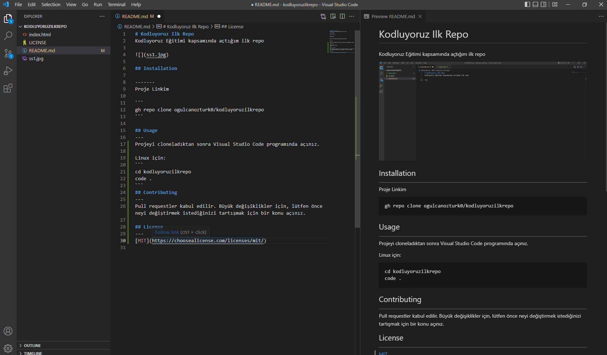

# Kodluyoruz Ilk Repo
Kodluyoruz Eğitimi kapsamında açtığım ilk repo



## Installation

-------
Proje Linkim

```
gh repo clone ogulcanozturk0/kodluyoruzilkrepo
```

## Usage
---
Projeyi cloneladıktan sonra Visual Studio Code programında açınız.

Linux için:
````
cd kodluyoruzilkrepo
code .
````
## Contributing
---
Pull requestler kabul edilir. Büyük değişiklikler için, lütfen önce neyi değiştirmek istediğinizi tartışmak için bir konu açınız.
## License
---
[MIT](https://choosealicense.com/licenses/mit/)